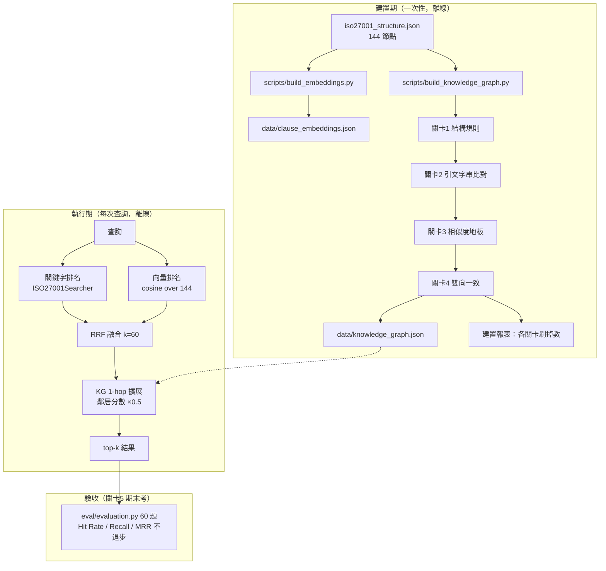

# SDD：Hybrid Search（RRF）+ Knowledge Graph 1-hop 重建計畫

> 版本：v1.4（2026-07-04）— **擁有者追認選項 A：合併**。合併標準正式修訂：原題 Hit Rate ≥ 98.3% ＋ 改寫題四指標全面提升（理由見 §10.6）
> 狀態：任務 A-D 完成，判定 A 已追認，收尾執行中（gated 設為預設 + 回歸護欄 + README 更新）
> 執行者：Codex CLI（提示詞見 `codex_kg_prompt.md`）
> 開發方法：SDD（本文件為權威規格）+ TDD（每 Phase 測試先行）

---

## 1. 背景與目標

README v3.9 宣稱的 Hybrid Search（RRF）+ KG 1-hop 實作與對應檔案
（`data/knowledge_graph.json`、`data/embeddings.npy`、`scripts/build_embeddings.py`）
**實際不存在於程式碼庫**。本計畫重建該能力，並新增「程式自動把關」的
KG 建置產線，全程使用地端模型（Ollama），不依賴雲端。

### 設計決策（已拍板，不再討論）

| 決策 | 結論 | 理由 |
|---|---|---|
| 提名模型 | 地端（gemma3:12b-16k + gemma4:e2b-mlx 雙提名器取聯集） | 未來機敏語料必須地端；品質由關卡保證，模型只影響產量；現在就用目標條件驗收架構 |
| KG 品質把關 | 五道程式關卡，零人工審核 | 引文字串比對等確定性驗證比 LLM 裁判可靠 |
| 融合演算法 | RRF（k=60），只比排名不比分數 | 免除跨檢索器分數正規化問題 |
| 離線性 | 建置期與執行期 100% 離線（localhost Ollama） | Strict Offline 是本專案核心約束 |
| 提名器優劣評估 | 產線關卡通過率 + 黃金邊召回 + 期末考，決策規則預先寫死 | 避免看到數字後憑感覺凹 |

## 2. 範圍

### In Scope
- 向量索引建置腳本與索引檔
- `HybridSearcher`：關鍵字 + 向量 RRF 融合 + KG 1-hop 擴展 + 離線退化
- KG 五道關卡建置產線（雙地端提名器）
- 提名器評測腳本（含黃金邊召回）
- 檢索評估回歸（60 題）

### Out of Scope
- 不修改 `search_tool.py` 既有關鍵字邏輯（HybridSearcher 是包裝層）
- 不修改 LV2/LV3 tools、Web UI、System Prompt
- 不做雲端模型稽核員（選配，另案）
- 不接入 `app.py` / `main.py`（整合為後續獨立變更，本案只交付可用元件 + 評估證據）

## 3. 架構



## 4. 交付物清單

| 檔案 | 類型 | 說明 |
|---|---|---|
| `src/iso27001_advisor/core/hybrid_search.py` | 新增 | `HybridSearcher` 類別 |
| `src/iso27001_advisor/core/kg_gates.py` | 新增 | 五道關卡的純函數（供產線與評測共用） |
| `scripts/build_embeddings.py` | 新增 | 144 節點向量索引建置 |
| `scripts/build_knowledge_graph.py` | 新增 | KG 建置產線（提名 → 關卡 → 輸出 + 報表） |
| `scripts/eval_nominator.py` | 新增 | 提名器 A/B 評測 |
| `data/clause_embeddings.json` | 產物 | 向量索引（版控） |
| `data/knowledge_graph.json` | 產物 | 過關邊集（版控） |
| `data/kg_gold_edges.json` | 產物 | 黃金邊（從 cht.md 官方交叉引用抽取） |
| `tests/test_rrf.py` 等 6 個測試檔 | 新增 | 見 §7 TDD 計畫 |

## 5. 規格細節

### 5.1 向量索引 `data/clause_embeddings.json`

```json
{
  "embed_model": "jeffh/intfloat-multilingual-e5-large-instruct:f16",
  "built_at": "ISO8601",
  "source_file": "data/iso27001_structure.json",
  "dimension": 1024,
  "items": [{"id": "control_8.13", "embedding": [0.01, "..."]}]
}
```

- 嵌入文本：`{subsection}\n{title}\n{content}`（document 端，不加 prefix，遵循 E5-instruct 規範，同 `semantic_cache.py`）
- 查詢端加 `semantic_cache._QUERY_INSTRUCTION` 同款 instruct prefix
- 排除父章節節點（id 不含小數點者，如 `clause_5`），與關鍵字端降權邏輯一致

### 5.2 `HybridSearcher`（`core/hybrid_search.py`）

```
HybridSearcher(searcher=None, emb_path=None, kg_path=None,
               host="http://localhost:11434", rrf_k=60, kg_damp=0.5)
  .search(query, limit=4) -> list[{"item": dict, "score": float, "source": str}]
  .is_hybrid_ready -> bool
```

行為規格：
1. 關鍵字排名：委派 `ISO27001Searcher.search(query, limit=20)`（取寬再融合）
2. 向量排名：查詢 embedding → cosine 對全索引 → 取前 20
3. RRF：`score(d) = Σ 1/(rrf_k + rank_i(d))`，rank 從 1 起算，僅出現於該路者只累加該路
4. KG 1-hop：融合後 top-limit 的每個節點，其 KG 鄰居以 `該節點 RRF 分數 × kg_damp` 併入；已在結果中者不重複、不加分；重排後截斷至 limit
5. **離線退化**：embedding 呼叫失敗 / 索引檔缺失 → 靜默退回純關鍵字結果（`source="keyword_fallback"`），**不得拋出例外**；KG 檔缺失 → 跳過擴展
6. `source` 欄位標記 `"rrf"` / `"kg_1hop"` / `"keyword_fallback"`，供除錯與測試斷言

### 5.3 KG 邊格式 `data/knowledge_graph.json`

```json
{
  "built_at": "ISO8601",
  "nominators": ["gemma3:12b-16k", "gemma4:e2b-mlx"],
  "gates_version": 1,
  "gate_report": {"nominated": 0, "g1_rejected": 0, "g2_rejected": 0,
                   "g3_rejected": 0, "g4_rejected": 0, "survived": 0},
  "edges": [{
    "from": "control_8.13", "to": "control_8.14",
    "evidence_from": "原文引句", "evidence_to": "原文引句",
    "similarity": 0.72,
    "nominated_by": ["gemma3:12b-16k"],
    "bidirectional": true
  }]
}
```

邊為無向：儲存時 `from < to`（字典序）正規化去重。

### 5.4 五道關卡（`core/kg_gates.py`，全部純函數）

| 關卡 | 函數簽名 | 規則 |
|---|---|---|
| G1 結構 | `gate_structure(edge, id_index) -> bool` | 無自環；兩端 id 存在；不得為父子章節（`clause_5` vs `clause_5.1`）；後續在圖層級套 degree cap ≤ 6（超過者保留 similarity 最高的 6 條） |
| G2 引文 | `gate_evidence(edge, id_index) -> bool` | `evidence_from` 去空白後為 `from` 節點 content/title 的子字串；`evidence_to` 同理；引句長度 ≥ 6 字 |
| G3 相似度 | `gate_similarity(edge, emb_index, floor=0.5) -> bool` | 兩端節點向量 cosine ≥ floor（重用向量索引，不另呼叫 embedding） |
| G4 雙向 | `gate_bidirectional(edge, all_nominations) -> bool` | A 問卷提名 B **且** B 問卷提名 A（任一提名器達成即可） |
| G5 期末考 | 非函數，為驗收程序 | 見 §6 驗收標準第 3 條 |

### 5.5 提名器協定（`build_knowledge_graph.py` 內）【v1.1 修訂：候選清單提名法】

> v1.0 的開放式提名（「這個節點的親戚有誰？」）經實跑證實：12B 模型單次呼叫
> 30 秒~3 分鐘，全量 774 次呼叫不可行，且開放式生成易提名不存在的 ID。
> v1.1 改為**候選清單確認法**：把生成任務降維成驗證任務。

- **候選預篩**：對每個節點，以向量索引（`clause_embeddings.json`）算 cosine，
  取 top-15 相似節點為候選清單（排除自己與父子章節）。此步驟純本地計算，零 LLM 成本。
- **提名 prompt**：給模型該節點的原文 + 15 個候選（各附 id、標題、content 前 200 字），
  要求只從候選中挑出真正相關者並附兩端原文引句，JSON 輸出：
  `{"related": [{"id": "...", "evidence_self": "...", "evidence_other": "..."}]}`；
  無相關者輸出 `{"related": []}`。
- 效益：(a) 輸出短、呼叫快；(b) 模型不可能提名候選外的幻覺 ID（程式再驗一層：
  非候選 ID 直接丟棄並計入格式失敗）；(c) G4 雙向一致仍然有效（A 的候選含 B、
  B 的候選含 A 時，雙向確認才成立——cosine 對稱，故互為候選通常成立）。
- 輪數：預設 N=2（`--rounds` 可調）。候選清單法下模型輸出變異小，2 輪足夠；
  聯集邏輯不變。
- JSON parse 失敗：記入該模型「格式失敗數」，該輪跳過，不重試超過 1 次
- 雙提名器（`--models gemma3:12b-16k,gemma4:e2b-mlx`）存活邊取聯集
- `--offline` 為預設且唯一模式；任何非 localhost 的網路呼叫視為違規

**建置作業規範（v1.1 新增）**：
1. **按模型分批**：先跑完模型 A 的全部節點，再跑模型 B——避免 Ollama 反覆
   載入/卸載 12B 模型（實跑觀察首次呼叫 3 分鐘即為模型載入成本）。
2. **背景執行**：全量建置以 `nohup python3 scripts/build_knowledge_graph.py ... &`
   或等效方式在背景跑，log 寫入 `tmp/kg_build.log`，靠既有 checkpoint 續跑。
3. **先煙霧測試**：正式全量前先 `--sample 3` 實測單次呼叫耗時，回報預估總時長，
   超過 12 小時則停下回報，不硬跑。

### 5.6 提名器評測 `scripts/eval_nominator.py`

- 抽樣 `--sample 25` 個節點（固定 seed=42 保證可重現）
- 輸出指標表（Markdown 到 stdout + `data/nominator_eval_results.json`）：
  格式合格率、引文誠實率（G2 通過/提名總數）、存活邊產量、收斂輪數（每輪新增存活邊曲線）、黃金邊召回率
- 黃金邊【v1.1 修訂】：`data/cht.md` 經實測無「其他資訊」交叉引用區塊（抽取 0 條），
  改以 **`data/pdca_graph.json` 的 `related` 欄位**為黃金邊來源——該圖譜為本專案
  既有的人工整理關聯（78 節點，含 cluster 分類），品質已受合規推薦系統長期使用驗證。
  `--extract-gold` 改為：讀 pdca_graph.json → 展開 `related` 對 → `from < to` 正規化
  去重 → 過濾兩端皆存在於 iso27001_structure.json 者 → 寫入 `data/kg_gold_edges.json`
  （`source` 欄位標 `"pdca_graph"`）。`next` 欄位（流程順序）不算關聯邊，不採用。

**預註冊決策規則（先寫死）**：
1. 格式合格率 < 90% → 淘汰
2. 引文誠實率差距 > 15 個百分點 → 選誠實者
3. 接近則選「存活產量 ÷ 收斂輪數」高者
4. 期末考 Recall 增量為一票否決

## 6. 驗收標準（全部可程式驗證）

1. `python3 -m pytest -q` 全綠（既有 200 + 新增測試，0 failed）
2. 離線退化：測試中以不可達 host 建 `HybridSearcher`，`search()` 回傳非空關鍵字結果且不拋例外
3. **期末考（G5）**：`python3 eval/evaluation.py` 以 HybridSearcher 重跑 60 題，
   Hit Rate@4 = 100%、Avg Recall@4 ≥ 93.3%、MRR@4 ≥ 0.9333（相對 keyword-only 基準不退步）；
   評估腳本需支援 `--hybrid` 開關以便對照
4. `build_knowledge_graph.py` 輸出 gate_report，`survived ≥ 1` 且每條存活邊通過全部四道關卡（以獨立驗證函數複核）
5. `eval_nominator.py` 產出完整指標表與 JSON 結果檔
6. 全流程無任何非 localhost 網路呼叫

## 7. TDD 實作計畫（Phase 化，每 Phase 紅→綠→驗證）

> 鐵律：先寫測試看它失敗（紅），再實作到通過（綠），每 Phase 結束跑全套
> `python3 -m pytest -q` 確認無回歸，才進下一 Phase。

| Phase | 先寫的測試 | 再寫的實作 | 驗證指令 |
|---|---|---|---|
| 0 基準 | — | 確認環境：`ollama list` 有兩個提名模型與 e5；記錄既有測試數 | `python3 -m pytest -q`（基準全綠） |
| 1 RRF 純函數 | `tests/test_rrf.py`：已知雙排名融合結果、單路獨佔項、空輸入、k 參數效果 | `hybrid_search.py` 的 `rrf_fuse()` 純函數 | `pytest tests/test_rrf.py -q` |
| 2 向量索引 | `tests/test_embedding_index.py`：schema 驗證、維度一致、父章節排除、缺檔錯誤訊息（用 3 節點 fixture，mock embedding） | `scripts/build_embeddings.py` + 索引載入器 | `pytest` + 實際建索引：`python3 scripts/build_embeddings.py` |
| 3 KG 關卡 | `tests/test_kg_gates.py`：每道關卡的通過/拒絕案例各 ≥ 2（自環、假引句、低相似、單向提名、degree cap） | `core/kg_gates.py` | `pytest tests/test_kg_gates.py -q` |
| 4 產線組裝 | `tests/test_kg_pipeline.py`：以 mock 提名器（回傳預製 JSON，含故意的垃圾邊）走完整產線，斷言 gate_report 數字與存活邊 | `scripts/build_knowledge_graph.py`（提名器呼叫抽象成可注入） | `pytest tests/test_kg_pipeline.py -q` |
| 5 HybridSearcher | `tests/test_hybrid_search.py`：RRF 整合、KG 1-hop 分數打折、**離線退化（不可達 host）**、source 標記 | `HybridSearcher` 類別完成 | `pytest tests/test_hybrid_search.py -q` |
| 6 提名器評測 | `tests/test_nominator_eval.py`：指標計算純函數（誠實率、收斂曲線、黃金召回），mock 提名資料 | `scripts/eval_nominator.py` + 黃金邊抽取 | `pytest tests/test_nominator_eval.py -q` |
| 7 實跑建置 | — | 實際執行：建索引 → 雙模型建 KG（真 Ollama）→ 提名器評測報表 | 檢查 gate_report、`data/knowledge_graph.json` 存在且非空 |
| 8 期末考 G5 | 於 `eval/evaluation.py` 加 `--hybrid` 開關（含小測試） | 跑 keyword vs hybrid 對照 | `python3 eval/evaluation.py --hybrid`：指標不退步 |

失敗處理：Phase 7/8 若指標退步，**不得調鬆關卡湊數**；先輸出退步題目清單與
diff 分析報告，停下等人決策。

## 8. 風險與緩解

| 風險 | 緩解 |
|---|---|
| 12B 模型 JSON 格式不穩 | 格式失敗計數 + 單次重試；評測指標會暴露嚴重度 |
| RRF 稀釋 `_INTENT_BOOSTS` 精準命中 | G5 期末考一票否決；`tests/test_recall_regression.py` 保底 |
| 建置耗時（144 節點 × 2 模型 × 3 輪） | 逐節點 checkpoint 寫入 tmp/，可中斷續跑（仿 eval checkpoint 模式） |
| 黃金邊抽取不到官方交叉引用 | 允許種子邊替代，記錄來源，不阻塞主線 |

---

## 9. v1.2 修訂：正式評測結果與 Phase 7 改道（2026-07-03）

### 9.1 正式提名器評測結果（--sample 25，每模型 100 次呼叫）

| 模型 | 格式合格率 | 引文誠實率 | 存活產量 | 黃金邊召回 | 判定 |
|---|---|---|---|---|---|
| gemma3:12b-16k | 92.0% | **12.73%** | 1 | 0.79% | 格式過關，但觸發誠實率 < 50% 重新設計條件 |
| gemma4:e2b-mlx | 48.0% | 4.0% | 0 | 0% | **淘汰**（預註冊規則 1） |

失敗型態分析：gemma3 的 G2 失敗主因為改寫、省略號、self/other 引句對調——
**12B 模型「一字不差複製長句」本身不可靠**，屬能力邊界而非 prompt 可修。

> **⚠️ 勘誤（2026-07-03）**：規格選型錯誤——使用者原始需求為 gemma3:12b vs
> **gemma4:12b** 的同量級對決，但 v1.0 規格誤沿用 README 預設後端標籤
> `gemma4:e2b-mlx`（effective-2B 級小模型）。因此上表淘汰判決**僅對
> e2b-mlx 成立**，`gemma4:12b-it-qat(-16k)` 從未受測。此錯誤不影響
> §9.2 改道決策（觸發點為 gemma3:12b 自身的誠實率），但影響 §9.3 重啟名單。

### 9.2 決策：LLM 提名產線暫停，KG 改由 pdca_graph 直建

- `data/pdca_graph.json` 的 `related` 欄位為人工整理、經合規推薦系統長期使用
  驗證的關聯邊（127 條）。G2/G4 的設計目的是「驗證 LLM 有無唬爛」，
  對人工邊為範疇錯誤，**不適用**。
- **Phase 7 改為**：`build_knowledge_graph.py --from-pdca` 直接從 pdca `related`
  建 KG——展開邊對、`from < to` 正規化去重、兩端需存在於 iso27001_structure.json、
  套 G1 結構規則 + degree cap ≤ 6、邊的 `source` 欄位標 `"pdca_graph"`、
  `evidence_*` 欄位置空（provenance 已由 source 說明）。G2/G3/G4 跳過，
  但**報表需附**全部邊的 G3 相似度分布（僅供參考，不做過濾）。
- **Phase 8 照舊**：pdca-KG 接上 HybridSearcher 跑 60 題期末考，
  指標不退步為合併條件、有提升為重啟 LLM 產線的價值證據。

### 9.3 LLM 提名產線的封存狀態與重啟條件

- 產線程式碼與測試**保留**（G1-G4、候選清單法、checkpoint、評測器），不刪除。
- 重啟條件：期末考證明 KG 1-hop 對檢索指標有正貢獻，且需要 pdca 未覆蓋的邊
  （pdca 覆蓋 78/129 節點）時。
- 重啟候選提名器：`gemma4:12b-it-qat-16k`（同量級對決的正確人選，見 §9.1 勘誤；
  選 16k 變體因候選清單 prompt 較長，理由同 gemma3:12b-16k）。
- 選配診斷（與期末考並行、互不阻塞）：以 gemma4:12b-it-qat-16k 重跑
  `eval_nominator.py --sample 25`（約 30 分鐘），鑑別「引文抄寫不可靠」是
  gemma3 個體問題還是 12B 量級通病——結果決定重啟時句子編號選擇法是否為必要。
- 重啟時的必要重新設計（已知能力邊界的對策）：evidence 由「自由引句」改為
  **句子編號選擇法**——候選內容以編號句子呈現，模型回傳句子索引，
  程式驗證索引存在。把「抄寫誠實」問題轉為「選擇有效」問題，
  12B 模型可勝任。黃金邊召回指標同時需修正分母（只計來源節點在樣本內的邊）。
- 選配診斷結果（gemma4:12b-it-qat-16k，--sample 25）：格式合格率 84%、
  引文誠實率 66.67%——顯著優於 gemma3:12b 的 12.73%，證實個體差異存在，
  但仍有 ID 錯配與欄位對調，**句子編號選擇法維持為重啟必要條件**；
  重啟時主提名器改為 gemma4:12b-it-qat-16k。

---

## 10. v1.3 修訂：Phase 8 期末考結果與後續（2026-07-03）

### 10.1 期末考結果（60 題，top_k=4，KG=pdca 125 邊）

| 指標 | keyword-only | hybrid（RRF+KG） | 差異 | 判定 |
|---|---|---|---|---|
| Hit Rate@4 | 100.0% | 96.7% | -3.3% | ❌ 一票否決 |
| Avg Recall@4 | 79.7% | 79.0% | -0.7% | ❌ |
| Avg Precision@4 | 37.1% | 35.4% | -1.7% | ❌ |
| MRR@4 | 0.8597 | 0.8917 | +0.032 | ✅ 排序品質提升 |

退步題：q52（外部認證稽核）、q56（新 SaaS 導入，`_INTENT_BOOSTS` +180 直配目標）。
根因：關鍵字規則照本評估集調校（基準 Hit Rate 100% = 天花板），RRF 等權融合
稀釋人工規則的精準命中——即 §8 風險表第 2 項的實現，G5 正確擋下。

**基準線勘誤**：README 記載的檢索指標（Recall 93.3% / MRR 0.9333）為早期
10 題基準集時代數字，60 題集的真實 keyword 基準為本表數值，README 待更新。
另 `data/eval_results.json` 本輪被覆寫且無 git 歷史可對證——**動工前先
git init + 基準 commit**。

### 10.2 認知修正：本評估集對 hybrid 天生不公平

基準已滿分（Hit Rate 100%），任何融合在此集上的天花板是平手；但 MRR +0.032
顯示向量在命中題內改善排序。正確問題不是「hybrid 好不好」，而是
「**何時該讓向量說話**」。

### 10.3 後續任務（依序）

**任務 A：消融實驗**。`eval/evaluation.py` 增加模式開關，跑四組對照：
`keyword` / `keyword+KG`（無 RRF） / `keyword+RRF`（無 KG） / `full`。
目的：隔離退步來源（目前 q52/q56 的鍋只是推測給向量背）。
若 keyword+KG 不退步 → KG 部分先行合併。

**任務 B：信心閘門（confidence-gated fusion）**【任務 A 後定案】。
HybridSearcher 新增 gated 模式，閘門罩住**整個增強層**（向量 RRF + KG 擴展，
全有或全無）：
- 關鍵字 top-1 分數 ≥ 100（boost/intent 觸發的最小加分值，先驗固定，禁止調整）
  → 高信心，回傳純 keyword 結果
- < 100 → 低信心，走完整 full（RRF + KG）
定案依據（任務 A 消融矩陣）：q52/q56 之 RRF 污染僅發生於高信心題（top-1=180）；
q51 之 KG 插隊僅發生於 keyword+KG 單獨模式，於 full 模式被向量重排吸收
（clause_9.1 被語意檢索拉回前排）——故 KG 不單獨疊加於高信心 keyword 之上。
**先驗預測（任務 B 實測檢驗此預測）**：gated 模式於原 60 題
Hit Rate = 100%（高信心題走 keyword 全過、低信心題走 full 全過、
q51 兩側皆過），MRR 於低信心題承接 full 之排序紅利。預測不中即回報推理漏洞。

**任務 C：改寫題評估集**。`scripts/generate_paraphrase_eval.py`：
以地端模型將 60 題問句改寫（clause_ids 標準答案不變、禁止照抄原題
連續 ≥ 6 字片段——程式驗證），輸出 `data/eval_dataset_paraphrase.json`。
LLM 只改寫問句、不產生答案，無誠實性風險。

**任務 D：雙軌期末考（新合併標準）**：
1. 原 60 題：gated-hybrid 不退步（閘門按構造保證，仍需實測確認）
2. 改寫 60 題：gated-hybrid 相對 keyword-only 有提升（hybrid 的價值證明）
兩者皆達成 → 合併；改寫題集無提升 → hybrid 封存，僅保留（若任務 A 過關的）KG。

### 10.4 任務 A 消融實驗結果（2026-07-04，commit 5bed1cc）

| 模式 | Hit Rate@4 | Recall@4 | Precision@4 | MRR@4 |
|---|---|---|---|---|
| keyword | 100.0% | 79.7% | 37.1% | 0.8597 |
| keyword+KG | 98.3%（q51 ❌） | 80.9% | 37.5% | 0.8556 |
| keyword+RRF | 96.7%（q52/q56 ❌） | 79.0% | 35.4% | 0.8917 |
| full（RRF+KG） | 96.7%（q52/q56 ❌） | 79.0% | 35.4% | 0.8917 |

關鍵發現：
- q52/q56 退步唯一根源為 RRF 等權融合稀釋 intent boost（兩題 top-1=180）
- q51 僅在 keyword+KG 失敗（rank-1 的 KG 鄰居 control_5.25 以 0.5 折扣分
  擠掉低分吊車尾的正解 clause_9.1）；於 full 模式被向量重排救回 → 證明
  KG 不應單獨疊加，應與 RRF 同進退
- MRR 提升（+0.032）來自向量對語意型問句的排序改善 → hybrid 價值存在，
  需要正確的出場時機（即任務 B 閘門）
- **勘誤**：本節原始報告稱 q52 top-1 score=180.0，任務 B 實測為 **88.6**
  （無任何 boost/intent 規則觸發）。§10.3 任務 B 的先驗預測即建立在此
  錯誤數字上。教訓：代理回報的關鍵數字須驗算後才可作為推理前提。

### 10.5 任務 B 結果（2026-07-04，commit 5052f3e）：預測未中，根因為 §10.4 錯誤數據

| 模式 | Hit Rate@4 | Recall@4 | Precision@4 | MRR@4 |
|---|---|---|---|---|
| keyword | 100.0% | 79.7% | 37.1% | 0.8597 |
| **gated** | **98.3%**（q52 ❌） | **80.2%** | **37.5%** | **0.8764** |
| full | 96.7% | 79.0% | 35.4% | 0.8917 |

- 信心分類：高信心 57 題（全數命中）；低信心 3 題（q43/q51/q52）
- 低信心分支戰績：q43 MRR 0.5→1.0、q51 MRR 0.25→1.0（Recall 33%→100%）、
  q52 Recall 33%→0%——**2 勝 1 敗，敗者原為無規則保護的邊緣險勝**
- q52 判讀：閘門分類**正確**（無規則觸發即低信心），非閘門漏洞；
  其退步是低信心分支的固有代價，非可修的 bug
- **決策**：不調門檻（禁止看答案改考卷）、不動題目。維持 gated 設計進
  任務 C/D。最終合併判定升級為**專案擁有者的記錄性取捨**：
  改寫題集若系統性提升 → 由擁有者決定是否以 v1.4 修訂合併標準
  （「原題 Hit Rate ≥ 98.3% 且改寫題顯著提升」），修訂須附理由留軌跡；
  改寫題無提升 → hybrid 全部封存，回到純 keyword。

### 10.6 任務 C/D 結果與最終判定（2026-07-04，commit 92be941）

任務 C：56/60 題成功改寫（gemma4:12b-it-qat-16k，4 題 skipped 保留原題），
連續 ≥ 6 字重疊過濾通過。

任務 D 雙軌期末考：

| 考場 | 模式 | Hit Rate@4 | Recall@4 | Precision@4 | MRR@4 |
|---|---|---|---|---|---|
| 原 60 題 | keyword | 100.0% | 79.7% | 37.1% | 0.8597 |
| 原 60 題 | gated | 98.3%（q52） | 80.2% | 37.5% | 0.8764 |
| 改寫 60 題 | keyword | **71.7%** | 54.2% | 22.9% | 0.5931 |
| 改寫 60 題 | gated | **76.7%（+5.0）** | 58.1%（+3.9） | 24.6%（+1.7） | 0.6222（+0.029） |

關鍵發現：
- **過擬合實測定量**：關鍵字規則離開考古題考場即從 100% 跌至 71.7%（-28.3pp）
- gated 於改寫考場四指標全面提升，救回 q26/q39/q52——**原題考場丟失的 q52，
  其改寫版被 gated 救回**（對稱性證據：q52 非被犧牲，是換考場存活）
- 低信心題 3 → 9（boost 字眼被改寫掉），驗證閘門分流預測
- gated 於改寫考場仍 14 題失敗（12 題與 keyword 共同失敗）——向量抬升
  天花板而非奇蹟，增益誠實

**最終判定（擁有者於 2026-07-04 追認）**：✅ **選項 A——合併**，標準修訂為 v1.4：
「原題 Hit Rate ≥ 98.3%（接受 q52 為低信心分支固有代價）＋
改寫題四指標全面提升」。理由：生產查詢分布更似改寫集；原題滿分為
過擬合幻影；雙資料集自此永久並列為回歸護欄。
（曾列選項：B 全部封存回純 keyword；C 合併但不設預設——均未採。）

### 10.7 收尾工作清單（v1.4）

1. gated 設為 `HybridSearcher.search()` 預設模式（keyword/full 保留為顯式參數）
2. 雙資料集回歸護欄進 pytest：原題 gated Hit Rate ≥ 98.3%、
   改寫題 gated Hit Rate ≥ 76.7%（以實測值為下限）
3. README 更新：雙軌實測指標表（註明舊 93.3%/0.9333 為 10 題時代過期數字）、
   v4.2 版本列改為完成、目錄結構「⚠️ 缺失」標記移除
4. `app.py` / `main.py` 接線仍屬 out of scope（§2），列為 v4.3 獨立變更
